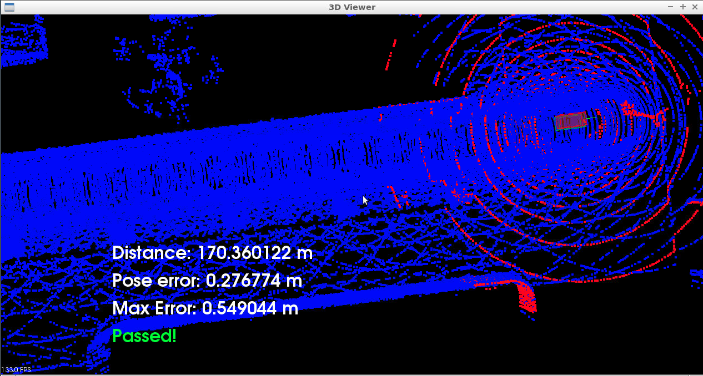

# Scan Matching Localization

Project goal is to localize a car driving in simulation for at least 170m from the starting position and never exceeding
a distance pose error of 1.2m. The simulation car is equipped with a lidar, provided by the simulator at regular intervals
are lidar scans. There is also a point cloud map map.pcd already available, and by using point registration matching 
between the map and scans localization for the car can be accomplished. This point cloud map has been extracted from the
CARLA simulator.

